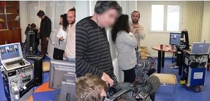
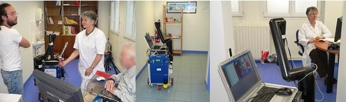
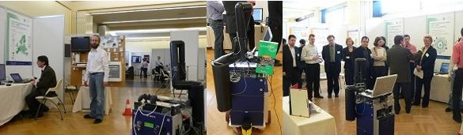
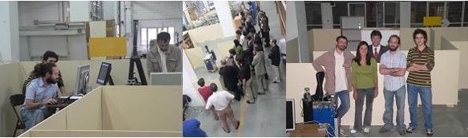

## Research activity within  CEA (2006-2007)

This research was performed within two projects:

- The European project ITEA ANSO gathers about 15 partners working together for designing technical solutions towards a domotic environment.
- AVISO is a French project, in collaboration with the association Approche (assistance to disable people).
  This partnership will allow the CEA to evaluate with real end-users their scientific productions within several medical centers.

### Towards Robotic Assistance for injured people

In few words, the CEA research concerns the design of a robotic arm able to grasp objects within a apartment-like environment.
A stereoscopic rig fixed onto the gripper is used to control the arm.
The end-user defines onto a display an object to grasp (by simply defining a box around it), and a visual servoing task is performed to go and fetch the defined object.

### Contribution to the project

Within this context, my work was to :

- develop a stereo tracking algorithm. The main originality is that no object model is needed.
- design a control module (based on visual servoing  principles) to command the arm.

The development of such elements enabled me to define several scientific libraries dealing with :

- algebra
- image grabbing
- camera calibration
- visual servoing
- feature extraction (Harris points) and tracking (differential correlation), template matching (exhaustive correlation)
- pose estimation

These libraries are now easily usable by the rest of the laboratory.

### The autonomous mobile robotic platform SAM

Within the ANSO project, all these hardware and software elements are embedded into a mobile platform (developed by Neobotix), which enables the user to perform a grasping wherever in his apartment.
This original application has the following skills:

- IHM designed for non specialists end-users, minimizing the number of interactions,
- Client /server mode enabling to interact with the mobile system, through a DPWS stack onto a wifi network,
- Action scheduling and monitoring controlled by a generic scenario interpretor layer,
- Autonomous mobile robot navigation (developed by Neobotix),
- Automatic object grasping (after a simple definition by the user).

### Related videos


Realized during technical evaluations, in January 2008,  Morvan hospital, Brest, France.

Realized during the ITEA ANSO evaluation, September 2007 the 13, at the CEA of Fontenay aux Roses.

This video presents the general behavior of the mobile robotic platform SAM developed by the <a target="_blank" href="http://www-list.cea.fr/index_gb.htm">CEA-LIST</a>, for improving the well-being of disabled people.

The mobile platform enables to go and grasp every-day_life objects within a domestic environment.
From a remote friendly man-machine interface, the user ask the robot to reach a topological room (like the kitchen).
When the mobile platform is within this place, the user defines the object to bring back, and the robotic arm realizes the grasping task.

This global application naturally gathers several high-level technologies. One of the originalities, from the user part, is that the grasping task is very easy to start, and also generic.
Simple because only two image clicks are necessary to select the object (this defines a box in which is the object of interest). Generic because no a priori information, like a 3D model, is used onto the object to grasp.
Any textured object can thus be considered without changing the program.

The robotic arm is designed by [Exact Dynamics](http://www.exactdynamics.nl/).
The mobile platform, and its navigation software, is a product of [Neobotix](https://www.neobotix-robots.com/).





These 3 videos illustrate the stereo tracking algorithm used for tracking the object to grasp.
The tracker does not rely on an a priori model of the object, but learns it from the interest points
found within the box delimited by the operator on the screen.
The object tracking is then obtained through _virtual visual servoing_ for stereoscopic systems.

### Related communication

Several press releases commented about that activity:

| `Date`| `Details` |
|------:|---------|
| **2008** | |
| 20 Feb | report in "Interception", on France Inter: _Ces robots qui nous veulent du bien..._ |
|20 Feb	| report in Ouest France Web: {}Bientôt des robots pour soulager le handicap?{}|
|18 Feb	| report in _La Tête au carré_, on France Inter ({}read{})  |
| Feb |	report in La Recherche, n.416 _un bras robotisé aide les handicapés_ |
|24 Jan | report in Ouest France {}Bientot des robots pour soulager le handicap?{} |
|24 Jan | report in le Télégramme: {}A l'heure des robots{} |
|18 Jan | report on the medical robotics developed at the CEA (including SAM), au journal de 20h de TF1    |
| **2007** ||
| Dec.	| Technical evaluation, centre médical de Brest   |
|11 Dec.| report in _Quotidien du médecin_: {}SAM, le robot qui rapporte{} |
|3-7 Dec. |	Clinical evaluation of the Aviso project, Reims|
|1 Dec. | report in newspaper La Montagne: {}Des robots pour faciliter la vie des personnes handicapées{} |
|30 Nov.| Dépêche AFP on SAM {}France: des robots pour faciliter la vie des personnes handicapées{}  |
|29 Nov	| Demo at _la journée de la Recherche sur le Handicap_, CEA de Saclay ({}see program{}) |
|19-23 Nov. | Clinical evaluation of the AVISO project, centre Hopale, Berck-sur-Mer |
|12-16 Nov. | Clinical evaluation of the AVISO project, centre de rééducation de Coubert|
|5-9 Nov. | Clinical evaluation of the AVISO project, hôpital universitaire Raymond Poincaré de Garches (Automatic grasping of objects using panoramic camera) |
|Nov. | Patent filling on the vision-based control system |
|18-19 Oct. | Demo of the ANSO project at the 2007 symposium 2007 of the ITEA2 programme, Berlin. Silver exhibition award    |
|13 Sept. | Evaluation of the ITEA ANSO project, CEA de Fontenay aux Roses (go to the video)    |

_Work in collaboration with Christophe Leroux, Gerard Chalubert, Martine Guerrand, Aline Chansavang, Céline Teulière & Mathieu le Cam.
